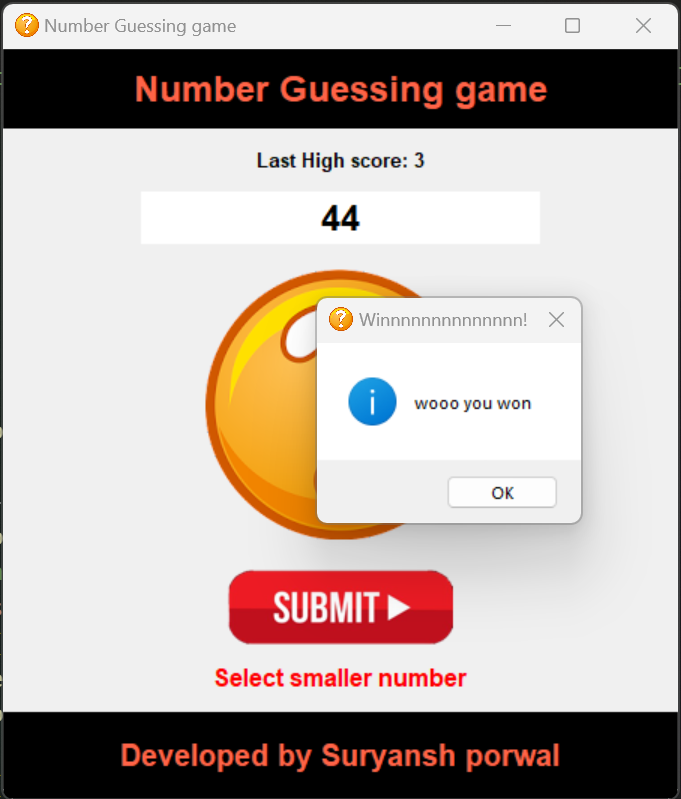

# Guess-game
### A GUI guess game in python
 

## requirements

tkinter ----> for gui
PIL ----> for image

### INSTALL by any Pip package manager

pip install tkinter
pip install PIL

# functionality

### This is a python code for a number guessing game using a GUI. It imports the necessary modules required for the game, such as 'tkinter' for the GUI, 'PIL' for handling images, and 'random' for generating random numbers. 

### The code begins by defining a 'generate()' function, which generates a random number between 1 and 50. Then, there is a 'basic()' function that sets up the screen with the game title, window size, logo, heading, and footer. The user's last high score is displayed at the top. 

### The 'result()' function validates the user's input and displays a message according to the input. It also keeps track of the number of attempts made by the user and updates the high score if the user wins. If the user loses, then a game over message is displayed. 

 ### The 'uservar' variable is used to get input from the user, and the 'Entry()' function creates a text input box where the user can enter their guess. The 'Button()' function is used to submit the guessed value by the user. If the user enters nothing or something other than a number, they are shown an error message.

### The 'restart()' function resets the game by generating a new random number. 

### Finally, the 'mainloop()' function is called to run the GUI and display the game on the screen.
